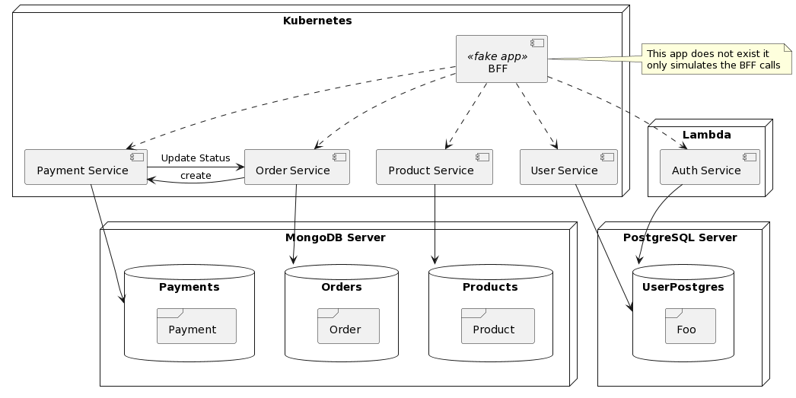

# FIAP - Tech Challenge IV

## Integrantes
- Lucas Arce Ruiz - RM349580
- Mauricio Gonçalves Pires Jr - RM349581

# Challenge 4 Entregáveis:

Dando continuidade ao desenvolvimento do software para a lanchonete, teremos as seguintes melhorias e alterações:

1. Refatore o projeto separando em ao menos 3 microsserviços;
1. Ao refatorar, os microsserviços devem conter testes unitários usando BDD com no mínimo 80% de cobertura de testes por cada microsserviço.
1. Seus repositórios devem ser separados para cada aplicação e devem respeitar as seguintes regras:
    1. Main Protejida
    1. PR para branch main deve validar o build da aplicação, e qualidade de codigo via sonarqube.
    1. Automatize o deploy dos seus microserviços.

# Arquitetura

# Links para os Repos

- Payment
    - [Payment Service](https://github.com/arceruiz/tech-challenge-payment)
    - [Payment Service GitOps](https://github.com/mauriciodm1998/payment-service-gitops)
- Order
    - [Order Service](https://github.com/arceruiz/tech-challenge-order)
    - [Order Service GitOps](https://github.com/mauriciodm1998/order-service-gitops)
- Product
    - [Product Service](https://github.com/arceruiz/tech-challenge-product)
    - [Product Service GitOps](https://github.com/mauriciodm1998/product-service-gitops)
- User
    - [User Service](https://github.com/mauriciodm1998/user-service)
    - [User Service GitOps](https://github.com/mauriciodm1998/user-service-gitops)
- [Auth Service](https://github.com/mauriciodm1998/auth-service)
- [Link](https://github.com/mauriciodm1998/auth-service) para repositorio do Lambda
- [Link](https://github.com/mauriciodm1998/tech-challenge-gitops) para repositorio Infra com Terraform

# SonarQube

Utilizamos uma ferramenta diferente que se aplica melhor em nossa linguagem. Estamos utilizando o [Semgrep](https://semgrep.dev/) para fazer a análise estática do nosso codigo rodando durante os pipes do GitHub Actions.
